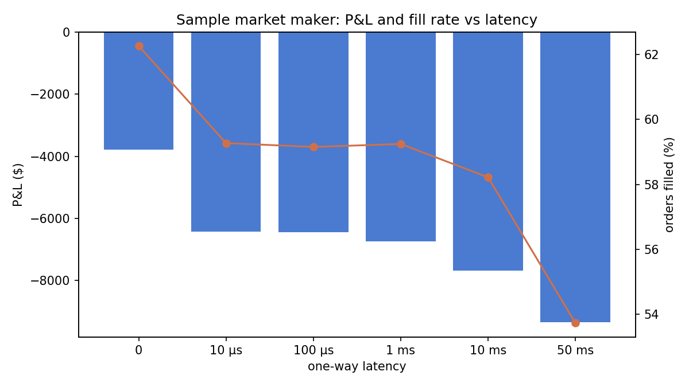
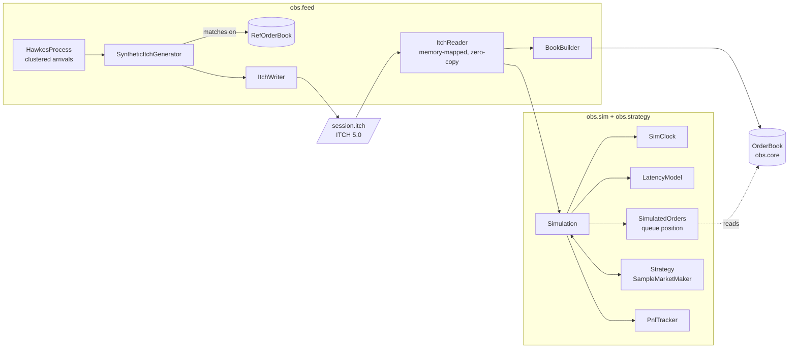

# OrderBookSim

A low-latency L3 limit order book and market simulator for one instrument, in plain Java 25.
- **Book:** a price-time priority matching engine that allocates nothing after startup. It replays about 9 million messages a second on one laptop core and is checked message by message against a simple reference implementation.
- **Feed:** order flow comes from a self-exciting (Hawkes) process and is written as byte-exact Nasdaq TotalView-ITCH 5.0.
- **Simulator:** a latency-aware simulator replays that feed against a trading strategy, tracking queue position exactly from L3 data. It shows what latency costs a simple market maker.

Built by following [`order-book-guide.md`](order-book-guide.md). [`IMPLEMENTATION_PLAN.md`](IMPLEMENTATION_PLAN.md) records every milestone, the bugs found in the guide's code, and where the build deviated from the plan.

## Results

AMD Ryzen 9 6900HS laptop (8 cores, 16 GB DDR5-4800), Windows 11, Java HotSpot 25.0.4.1, `-Xms2g -Xmx2g -XX:+AlwaysPreTouch`. All figures were measured; full tables, error bars and caveats are in [`docs/BENCHMARKS.md`](docs/BENCHMARKS.md).

| | Fast book | Reference book (TreeMap) |
|---|---|---|
| Realistic mix (48% cancels), JMH | **114 ns/msg** | 379 ns/msg |
| Cancel from a 1,000-order queue, JMH | **38 ns** | 270 ns |
| p50 / p99 / p99.9 per message (HdrHistogram, 100 ns clock) | **100 / 400 / 700 ns** | 100 / 2,101 / 3,101 ns |
| Allocation on the hot path | **0 bytes** (JMH `-prof gc`, 200M messages under Epsilon GC, per-thread counter test) | 87 bytes/msg |
| Full-day synthetic ITCH replay (4.0M messages) | **9.04M msg/s** single thread | |

The fast book is not faster at everything. On single operations against a small book it loses to the TreeMap book (for example, add then cancel: 110 ns against 46 ns), because a 1M-order id map is bigger than the CPU cache. See [where the design loses](#where-the-design-loses).

**Latency costs a market maker money** (full synthetic day, same session at every latency):



## Run it

Needs a JDK 25 on the path; the Gradle wrapper downloads everything else. On Windows use `gradlew.bat`.

```
./gradlew build          # compile and run all 197 tests
./gradlew itchSession    # generate a full trading day as ITCH, replay it into the fast book, check it
./gradlew latencySweep   # run the sample market maker at 0 / 10 µs / 100 µs / 1 ms / 10 ms / 50 ms
```

Other tasks:
- `latency`: HdrHistogram percentiles and a coordinated omission demo
- `epsilonSmoke`: 200M messages under the no-op garbage collector
- `jmh`: benchmarks
- `pipelinedReplay`: one thread vs two
- `run`: prints the guide's Part 0 example

`python tools/plot_pnl.py` draws the charts (needs matplotlib).

## Architecture



| Package | Contents | Depends on |
|---|---|---|
| `obs.mem` | `LongIntMap`, `LongBitSet`, `SpscLongRingBuffer` | JDK only |
| `obs.core` | `OrderBook`, `OrderPool`, `BookValidator`, the `Book` interface, `Prices` | `mem` |
| `obs.ref` | `RefOrderBook`: slow, obviously correct, kept for testing and as the generator's matching engine | `core` |
| `obs.feed` | Hawkes process, synthetic generator, ITCH writer/reader, book builder, pipelined replay | `core`, `mem`, `ref` |
| `obs.sim`, `obs.strategy` | Event clock, latency model, queue-position inference, simulation, market maker | `core`, `feed` |
| `obs.metrics`, `obs.workload` | HdrHistogram recorder, P&L, fill stats, benchmark workloads | |

`ArchitectureTest` fails the build if `core` or `mem` reference any other package or any third-party library.

## Design decisions

| Decision | Rejected alternative | Why |
|---|---|---|
| **Flat array of price levels**, indexed by `(price − base) / tick` | `TreeMap<Long, Level>` | One array access instead of a ~14-level tree walk where each hop can miss the cache. Neighbouring prices are neighbours in memory, which matters when matching sweeps levels. |
| **Intrusive doubly-linked lists** threaded through the order pool | `ArrayDeque` / `LinkedList` per level | Cancels are the most common message. Unlinking is O(1) with no node objects; the reference book's `ArrayDeque.remove` scans the queue, and measures 7× slower from a 1,000-order queue. |
| **Struct-of-arrays order pool** with a free list, fixed capacity, fails loudly when full | `new Order(...)` per add; growing the pool | Nothing to garbage-collect, so no GC pauses. A mid-run resize would be a latency spike that corrupts measurements. |
| **Open-addressing `long → int` map** with backward-shift deletion and fmix64 hashing | `HashMap<Long, Integer>` | No boxing and no nodes: `HashMap` allocates 96 bytes per add/remove. Without the hash mix, deletion degrades ~1,500× on sequential ids ([measured](docs/BENCHMARKS.md#hashing-experiment)). |
| **Bitset of non-empty levels** to find the next best price | Scan one level at a time | 18× faster across a 10,000-level gap, no slower when levels are adjacent. The linear scan is kept as an option so this stays measurable. |
| **Single writer**: one thread owns the book | Concurrent matching with locks | Price-time priority is an ordering rule, so matching is sequential anyway, and replay stays deterministic. Scale by sharding instruments. A two-thread pipeline was built and measured: [no faster](docs/BENCHMARKS.md#threading-pipelined-replay) for file replay. |
| **Two entry modes**: matching (`addLimitOrder`) and book-builder (`addRestingOrder`, `execute`, `replace`) | One mode | An exchange feed has already been matched; re-matching it would double-count trades. |
| **Synthetic flow written as real ITCH**, matched by the reference book | Feed events straight into the fast book | The generator never depends on the code it tests, and everything downstream reads the same bytes a Nasdaq file would give. |
| **Hawkes arrivals** with a fair-value random walk and informed takers | Poisson arrivals around a fixed price | Real flow clusters in bursts. Without a moving fair value the simulator measured exactly the same P&L at every latency. |
| **L3 queue position from arrival sequence numbers**; strategy orders never enter the historical book | Insert strategy orders into the book (the guide's "shadow book") | ITCH has no aggressor orders to re-match, only executions against specific resting orders. Comparing sequence numbers tells exactly which real orders were ahead. |
| **Integer prices**, 4 implied decimals everywhere | `double` | $0.01 isn't representable in binary floating point, and prices are compared for equality constantly. |

## Where the design loses

- **Cache size, not the algorithm, dominates small books.** With a 1M-order pool the id map is 24 MB, more than the 16 MB L3 cache, and randomly addressed. Single operations then run 2–4× slower than the TreeMap book. A 4,096-order pool fixes add-then-cancel (34 ns), but crossing still loses, because a fill reads seven separate pool arrays.
- **The price ladder is fixed.** $100–$299.99 at a cent is 20,000 levels and fine for one equity. An unbounded instrument (futures, crypto) would need re-centering or a sparse fallback far from the touch.
- **The pool is a hard ceiling.** It fails loudly rather than growing.
- **No market impact.** Strategy orders are placed into history that happened without them: historical orders still trade after the strategy took their liquidity, and nobody reacts to its quotes. That is tolerable for small orders in liquid names and wrong for large ones.
- **Synthetic data only.** The feed is realistic in structure (clustered, cancel-heavy at 23.6 cancels per execution, informed flow), but the dollar amounts in the latency sweep depend heavily on its parameters. Real ITCH files (over 2 GB, needing a `MemorySegment` reader) and LOBSTER data are planned but not done.
- **Two threads don't speed up file replay.** Parsing is too cheap to be worth offloading.
- **The sample market maker loses money at every latency.** It has no signal and no inventory skew; it exists to exercise the simulator. Its position limit is soft (1,099 against 1,000) because in-flight orders can fill past it.

## How correctness is checked

- **Differential testing.** jqwik generates thousands of random sessions (adds, crosses, market orders, cancels, reduces, executes, replaces, invalid input). After every message, the fast book must agree with `RefOrderBook` on the result code, every trade, and full depth. A seeded 1M-message run does the same.
- **Invariant validation.** `BookValidator` walks the whole structure after every message in tests, on both sides:
  - links, cached totals, the bitset and the touch
  - time priority
  - that pool and map agree
  - the book never crosses in matching mode
- **Planted bugs.** Separate copies of the project with a touch bug, a reduce bug, and blank-slot map deletion each failed the suite.
- **Byte fixtures.** Every ITCH message the writer produces is compared with bytes written out by hand from the specification, so the writer and reader can't share a wrong offset unnoticed.
- **Round trip.** The generator's reference book and the fast book rebuilt from the ITCH bytes must match after every generated event, over a 10-minute session and 25 random seeds. A full 4M-message day ends identical.
- **Simulation.** The guide's queue-position walkthrough is a literal test. Hand-written ITCH sessions pin exact callback timings under latency. Identical inputs give identical results, down to every P&L sample.
- **Zero allocation.** A test reads the JVM's per-thread allocation counter across a million-message replay: 0 bytes.

## Interview questions this answers

- *Why not a TreeMap?* See the design table, then the concession: it wins on small books when the id map outgrows the cache.
- *Your p99.9 is 7× your median, why?* Per-message latency here is quantised by Windows' 100 ns `nanoTime` steps, and the ~150 µs maxima are most likely OS scheduling. The [coordinated omission demo](docs/BENCHMARKS.md#coordinated-omission) shows how a 50 ms stall hides behind a 1.3 µs p99.9 unless latency is measured from intended start times.
- *How do you know it's correct?* See above.
- *What's the most unrealistic thing about the simulator?* No market impact.
- *Why single-threaded?* Ordering, determinism, and a measured result that two threads didn't help.
