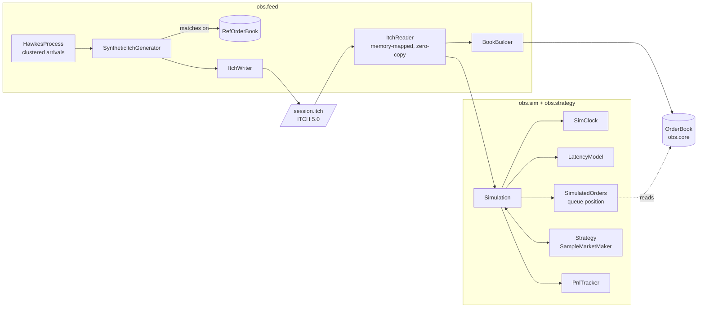

# OrderBookSim

A low-latency L3 limit order book and market simulator for one instrument, in plain Java 25.
- **Book:** a price-time priority matching engine that allocates nothing after startup. It replays a full synthetic trading day at about 21 million messages a second on a single thread, and is checked event by event against a simple reference implementation.
- **Feed:** order flow comes from a self-exciting (Hawkes) process and is written as byte-exact Nasdaq TotalView-ITCH 5.0.
- **Simulator:** a latency-aware simulator replays that feed against a trading strategy, tracking queue position exactly from L3 data. It shows what latency costs a simple market maker.

Built by following [`order-book-guide.md`](order-book-guide.md). [`IMPLEMENTATION_PLAN.md`](IMPLEMENTATION_PLAN.md) records every milestone, the bugs found in the guide's code, and where the build deviated from the plan.

## Results

AMD Ryzen 9 6900HS laptop (8 cores, 16 GB DDR5-4800), Windows 11, Java HotSpot 25.0.4.1, `-Xms2g -Xmx2g -XX:+AlwaysPreTouch`. All figures were measured; full tables, error bars and caveats are in [`docs/BENCHMARKS.md`](docs/BENCHMARKS.md).

| | Fast book | Reference book (TreeMap) |
|---|---|---|
| Full-day ITCH replay (4.0M messages), single thread | **21.6M msg/s** (46 ns/msg) | 7.1M msg/s (141 ns/msg) |
| Benchmark tape, JMH | **30.0 ns/msg** | 121.5 ns/msg |
| Cancel from a 1,000-order queue, JMH | **32.3 ns** | 320.6 ns |
| p99 / p99.9 per message on the replay (100 ns clock) | **100 / 1,000 ns** | 700 / 1,300 ns |
| Worst message on the replay | **90 µs** | 1.7 ms (a G1 pause) |
| Allocation on the hot path | **0 bytes** (JMH `-prof gc`, 200M messages under Epsilon GC, per-thread counter test) | 93 bytes/msg |

The median is not in that table because this machine's clock can't resolve it: `System.nanoTime` moves in 100 ns steps and the fast book's p50 is below one step.

About half the gain is one change. `RefLinkedOrderBook` is the reference book with `ArrayDeque` swapped for an intrusive linked list, nothing else, and it replays the same day at 14.8M msg/s. The array ladder, order pool and primitive id map take it from there to 21.6M, but only because the pool is sized to the book: with a 1M-order pool the id map outgrows the L3 cache and the fast book drops to 11.8M, behind the TreeMap version.

It is not faster at everything, and it was slower at most things until the pool was sized correctly. See [where the design loses](#where-the-design-loses).

**Latency costs a market maker money** (full synthetic day, same session at every latency):


## Run it

Needs a JDK 25 on the path; the Gradle wrapper downloads everything else. On Windows use `gradlew.bat`.

```
./gradlew build          # compile and run all 225 tests
./gradlew itchSession    # generate a full trading day as ITCH, replay it into the fast book, check every event
./gradlew latencySweep   # run the sample market maker at 0 / 10 µs / 100 µs / 1 ms / 10 ms / 50 ms
```

Other tasks:
- `replayLatency -PreplayArgs="fast|ref|refLinked"`: full-day replay throughput (median of warmed runs) and per-message percentiles for one book
- `latency`: HdrHistogram percentiles on the benchmark tape and a coordinated omission demo
- `jacocoTestReport`: line coverage in `build/reports/jacoco`
- `epsilonSmoke`: 200M messages under the no-op garbage collector
- `jmh`: benchmarks
- `pipelinedReplay`: one thread vs two
- `run`: prints the guide's Part 0 example

`python tools/plot_pnl.py` draws the charts (needs matplotlib).

## Architecture



| Package | Contents | Depends on |
|---|---|---|
| `obs.mem` | `LongIntMap`, `LongBitSet`, `SpscLongRingBuffer` | JDK only |
| `obs.core` | `OrderBook`, `OrderPool`, `BookValidator`, the `Book` interface, `Prices` | `mem` |
| `obs.ref` | `RefOrderBook`: slow, obviously correct, kept for testing and as the generator's matching engine. `RefLinkedOrderBook`: the same with O(1) cancel, kept to measure what each part of the fast book buys | `core` |
| `obs.feed` | Hawkes process, synthetic generator, ITCH writer/reader, book builder, pipelined replay | `core`, `mem`, `ref` |
| `obs.sim`, `obs.strategy` | Event clock, latency model, queue-position inference, simulation, market maker | `core`, `feed` |
| `obs.metrics`, `obs.workload` | HdrHistogram recorder, P&L, fill stats, benchmark workloads | |

`ArchitectureTest` fails the build if `core` or `mem` reference any other package or any third-party library.

## Design decisions

| Decision | Rejected alternative | Why |
|---|---|---|
| **Flat array of price levels**, indexed by `(price − base) / tick` | `TreeMap<Long, Level>` | One array access instead of a ~14-level tree walk where each hop can miss the cache. Neighbouring prices are neighbours in memory, which matters when matching sweeps levels. |
| **Intrusive doubly-linked lists** threaded through the order pool | `ArrayDeque` / `LinkedList` per level | Cancels are the most common message. Unlinking is O(1) with no node objects; the reference book's `ArrayDeque.remove` scans the queue, and measures 9.9× slower from a 1,000-order queue. |
| **Struct-of-arrays order pool** with a free list, fixed capacity, fails loudly when full | `new Order(...)` per add; growing the pool | Nothing to garbage-collect, so no GC pauses. A mid-run resize would be a latency spike that corrupts measurements. |
| **Pool and id map sized to the book** (2× the most resting orders, 16,384 for the synthetic session) | Size for the worst case (1M orders) | A 1M-order pool makes the id map 24 MB, bigger than the L3 cache. On the full-day replay that costs almost half the throughput: 11.8M msg/s against 21.6M, slower than a TreeMap book with O(1) cancel. |
| **Open-addressing `long → int` map** with backward-shift deletion and fmix64 hashing | `HashMap<Long, Integer>` | No boxing and no nodes: `HashMap` allocates 96 bytes per add/remove. Without the hash mix, deletion degrades ~2,500× on sequential ids ([measured](docs/BENCHMARKS.md#hashing-experiment)). |
| **Bitset of non-empty levels** to find the next best price | Scan one level at a time | 15.9× faster across a 10,000-level gap, and within noise of the scan when levels are adjacent. The linear scan is kept as an option so this stays measurable. |
| **Single writer**: one thread owns the book | Concurrent matching with locks | Price-time priority is an ordering rule, so matching is sequential anyway, and replay stays deterministic. Scale by sharding instruments. A two-thread pipeline was built and measured: [no faster](docs/BENCHMARKS.md#threading-pipelined-replay) for file replay. |
| **Two entry modes**: matching (`addLimitOrder`) and book-builder (`addRestingOrder`, `execute`, `replace`) | One mode | An exchange feed has already been matched; re-matching it would double-count trades. |
| **Synthetic flow written as real ITCH**, matched by the reference book | Feed events straight into the fast book | The generator never depends on the code it tests, and everything downstream reads the same bytes a Nasdaq file would give. |
| **Hawkes arrivals** with a fair-value random walk and informed takers | Poisson arrivals around a fixed price | Real flow clusters in bursts. Without a moving fair value the simulator measured exactly the same P&L at every latency. |
| **L3 queue position from arrival sequence numbers**; strategy orders never enter the historical book | Insert strategy orders into the book (the guide's "shadow book") | ITCH has no aggressor orders to re-match, only executions against specific resting orders. Comparing sequence numbers tells exactly which real orders were ahead. |
| **Integer prices**, 4 implied decimals everywhere | `double` | $0.01 isn't representable in binary floating point, and prices are compared for equality constantly. |

## Where the design loses

- **Most of the win is the O(1) cancel, and the rest only exists when the id map fits in cache.** `RefLinkedOrderBook` keeps the TreeMap, the HashMap and an object per order, and only swaps `ArrayDeque` for a linked list. That alone takes the full-day replay from 7.1M to 14.8M msg/s. The array ladder, pool and primitive map take it to 21.6M, but with a 1M-order pool (a 24 MB id map, bigger than the 16 MB L3 cache) the fast book drops to 11.8M, behind the TreeMap book.
- **Get the pool wrong and three of the four single operations invert.** At 1,048,576 orders: add-then-cancel 89.7 ns against the TreeMap book's 49.4, crossing 108.2 against 43.2, a five-level sweep 3,516 against 1,947. Only the deep-queue cancel still wins, because that one is dominated by the reference book's scan.
- **A fill reads seven separate pool arrays** (id, qty, level, side, sequence, next, prev), so the struct-of-arrays layout costs cache lines exactly where matching needs them.
- **The price ladder is fixed.** $100–$299.99 at a cent is 20,000 levels and fine for one equity. An unbounded instrument (futures, crypto) would need re-centering or a sparse fallback far from the touch.
- **The pool is a hard ceiling.** It fails loudly rather than growing.
- **No market impact.** Strategy orders are placed into history that happened without them: historical orders still trade after the strategy took their liquidity, and nobody reacts to its quotes. That is tolerable for small orders in liquid names and wrong for large ones.
- **Synthetic data only.** Every message replayed and validated here comes from the generator; no real market data has been run. The feed is realistic in structure (clustered, cancel-heavy at 23.6 cancels per execution, informed flow), but the dollar amounts in the latency sweep depend heavily on its parameters. Real ITCH files (over 2 GB, needing a `MemorySegment` reader) and LOBSTER data are planned but not done.
- **Medians are below the clock.** Windows' `System.nanoTime` moves in 100 ns steps, so the fast book's per-message p50 can't be resolved; compare means (JMH) and tails instead.
- **Two threads don't speed up file replay.** Parsing is too cheap to be worth offloading.
- **The sample market maker loses money at every latency.** It has no signal and no inventory skew; it exists to exercise the simulator. Its position limit is soft (1,099 against 1,000) because in-flight orders can fill past it.

## How correctness is checked

- **Differential testing.** jqwik generates thousands of random sessions (adds, crosses, market orders, cancels, reduces, executes, replaces, invalid input). After every message, the fast book must agree with `RefOrderBook` on the result code, every trade, and full depth. A seeded 1M-message run does the same.
- **Invariant validation.** `BookValidator` walks the whole structure after every message in tests, on both sides:
  - links, cached totals, the bitset and the touch
  - time priority
  - that pool and map agree
  - the book never crosses in matching mode
- **Planted bugs.** Separate copies of the project with a touch bug, a reduce bug, and blank-slot map deletion each failed the suite.
- **Byte fixtures.** Every ITCH message the writer produces is compared with bytes written out by hand from the specification, so the writer and reader can't share a wrong offset unnoticed.
- **Round trip.** The generator's reference book and the fast book rebuilt from the ITCH bytes must match after every generated event, over a 10-minute session and 25 random seeds in the tests. `gradlew itchSession` does the same over a full day: 3,941,931 events (touch and order count), 3,942 full-depth snapshots and 81,667 executions, with 0 mismatches and 0 messages referring to an unknown order. This is synthetic data, so a clean result is expected by construction; it shows the fast book reconstructs what the reference book did, not that it survives a real feed.
- **Simulation.** The guide's queue-position walkthrough is a literal test. Hand-written ITCH sessions pin exact callback timings under latency. Identical inputs give identical results, down to every P&L sample.
- **Zero allocation.** A test reads the JVM's per-thread allocation counter across a million-message replay: 0 bytes.

## Interview questions this answers

- *Why not a TreeMap?* Measured: a TreeMap book with O(1) cancel gets half way (7.1M → 14.8M msg/s on the full-day replay), the array ladder, pool and primitive map the other half (21.6M). The concession: with a worst-case 1M-order pool the id map outgrows the cache and the TreeMap version wins.
- *What's your median latency?* Below what this machine's clock can resolve (100 ns steps). The mean is 46 ns per message on the replay; p99 is 100 ns against 600–700 ns for the reference book.
- *Where does your tail come from?* Not GC: the fast book collects nothing during a replay, while the reference book's 1.5–2 ms maxima line up with its G1 pauses. The fast book's ~50–150 µs maxima are most likely OS scheduling. The [coordinated omission demo](docs/BENCHMARKS.md#coordinated-omission) shows how a 50 ms stall hides behind a 1.2 µs p99.9 unless latency is measured from intended start times.
- *How do you know it's correct?* See above.
- *What's the most unrealistic thing about the simulator?* No market impact.
- *Why single-threaded?* Ordering, determinism, and a measured result that two threads didn't help.
