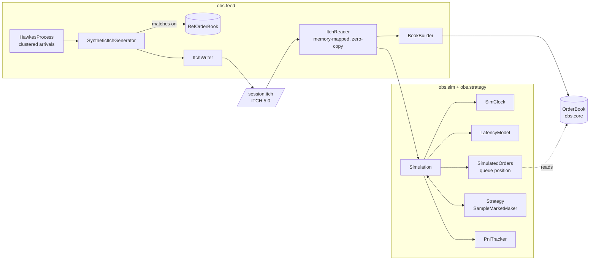

# OrderBookSim

A low-latency L3 limit order book and market simulator, in plain Java 25, run on a full day of real Nasdaq data.
- **Book:** a price-time priority matching engine that allocates nothing after startup. It replays real Nasdaq stocks at 16–27 million messages a second on a single thread, and the whole market (910 million order messages, 12,119 stocks) at 4 million a second. It is checked message by message against a simple reference implementation.
- **Feed:** reads Nasdaq TotalView-ITCH 5.0 files of any size. A synthetic feed from a self-exciting (Hawkes) process, written as byte-exact ITCH, is kept for testing.
- **Simulator:** a latency-aware simulator replays a feed against a trading strategy, tracking queue position exactly from L3 data. It shows what latency costs a simple market maker on real stocks.

Built by following [`order-book-guide.md`](order-book-guide.md). [`IMPLEMENTATION_PLAN.md`](IMPLEMENTATION_PLAN.md) records every milestone, the bugs found in the guide's code, and where the build deviated from the plan.

## Results

AMD Ryzen 9 6900HS laptop (8 cores, 16 GB DDR5-4800), Windows 11, Java HotSpot 25.0.4.1, `-Xms2g -Xmx2g -XX:+AlwaysPreTouch`. Data: Nasdaq TotalView-ITCH 5.0 for 12 December 2025 (29.4 GB, 924M messages). Timings cover decoding a message already in memory and applying it to the book. All figures were measured; full tables, error bars and caveats are in [`docs/BENCHMARKS.md`](docs/BENCHMARKS.md).

| Real Nasdaq data, one thread | Fast book | Reference book (TreeMap) |
|---|---|---|
| SPY, full day (21.2M messages) | **27.0M msg/s** (37 ns/msg) | 12.4M msg/s (80 ns/msg) |
| NVDA, full day (13.8M messages, up to 212,000 orders resting) | **16.7M msg/s** (60 ns/msg) | 4.7M msg/s (213 ns/msg) |
| Whole market: 12,119 stocks, one book each, 910M order messages | **4.0M msg/s** (251 ns/msg) | |
| NVDA p99 / p99.9 per message (100 ns clock) | **300 / 400 ns** | 800 / 2,200 ns |
| NVDA worst message | **232 µs** | 7.2 ms (G1 pauses) |
| Checked against the reference book, message by message | **86.4M order messages, 7 stocks, 0 mismatches** | |

| Synthetic and micro-benchmarks | Fast book | Reference book (TreeMap) |
|---|---|---|
| Synthetic full-day ITCH replay (4.0M messages) | **25.6M msg/s** (39 ns/msg) | 8.2M msg/s (122 ns/msg) |
| Benchmark tape, JMH | **31.8 ns/msg** | 119.6 ns/msg |
| Cancel from a 1,000-order queue, JMH | **30.9 ns** | 268.1 ns |
| Allocation on the hot path | **0 bytes** (JMH `-prof gc`, 200M messages under Epsilon GC, per-thread counter test; 0 GC collections on every real replay) | 93 bytes/msg |

The median is not in those tables because this machine's clock can't resolve it: `System.nanoTime` moves in 100 ns steps and the fast book's p50 is at or below one step.

**Real data needed one design change.** Every busy stock in the file had resting orders from $0.0001 to $199,999, far too wide for a flat price array. The book now keeps its array around where the stock trades and puts far-away prices on a small sorted side structure ([design](#design-decisions)).

**Where the speed comes from depends on the data.** On the synthetic day, swapping the reference book's queues for an intrusive linked list (`RefLinkedOrderBook`) doubles its speed. On real stocks the same swap gains only 10–20%, and most of the fast book's 2.2–3.6× lead comes from the array ladder, the order pool and the primitive id map.

**Memory decides the rest.** With a 1M-order pool the id map outgrows the L3 cache and the synthetic replay drops from 25.6M to 15.6M msg/s. Across the whole market, 2.1 GB of books make each message 4–7× slower than in a single-stock replay. See [where the design loses](#where-the-design-loses).

**Latency costs a market maker money, and far more on real data** (NVDA's full day, same session at every latency; the simulator has no market impact, so trust the shape more than the dollars):


## Run it

Needs a JDK 25 on the path; the Gradle wrapper downloads everything else. On Windows use `gradlew.bat`.

```
./gradlew build          # compile and run all 234 tests
./gradlew itchSession    # generate a full trading day as ITCH, replay it into the fast book, check every event
./gradlew latencySweep   # run the sample market maker at 0 / 10 µs / 100 µs / 1 ms / 10 ms / 50 ms
```

With a real Nasdaq TotalView-ITCH 5.0 day (unzipped, e.g. `S121225-v50.txt`):

```
./gradlew itchSurvey    -PsurveyArgs="S121225-v50.txt 40"                   # every stock: message counts, price ranges, most orders resting
./gradlew itchExtract   -PextractArgs="S121225-v50.txt data/real SPY NVDA"  # one small ITCH file per stock
./gradlew realCheck     -PcheckArgs="data/real SPY NVDA"                    # fast book vs reference book after every message
./gradlew replayLatency -PreplayArgs="fast 4 data/real/NVDA.itch NVDA"      # throughput and percentiles on one real stock
./gradlew fullDayReplay -PdayArgs="S121225-v50.txt 2 1024 latency"          # the whole day, one book per stock
./gradlew latencySweep  -PsweepArgs="real data/real/NVDA.itch NVDA"         # the market maker on a real stock
```

Other tasks:
- `replayLatency -PreplayArgs="fast|ref|refLinked"`: full-day replay throughput (median of warmed runs) and per-message percentiles for one book
- `latency`: HdrHistogram percentiles on the benchmark tape and a coordinated omission demo
- `jacocoTestReport`: line coverage in `build/reports/jacoco`
- `epsilonSmoke`: 200M messages under the no-op garbage collector
- `jmh`: benchmarks
- `pipelinedReplay`: one thread vs two
- `run`: prints the guide's Part 0 example

`python tools/plot_pnl.py` draws the charts (needs matplotlib).

## Architecture



| Package | Contents | Depends on |
|---|---|---|
| `obs.mem` | `LongIntMap`, `LongBitSet`, `SpscLongRingBuffer` | JDK only |
| `obs.core` | `OrderBook`, `OrderPool`, `BookValidator`, the `Book` interface, `Prices` | `mem` |
| `obs.ref` | `RefOrderBook`: slow, obviously correct, kept for testing and as the generator's matching engine. `RefLinkedOrderBook`: the same with O(1) cancel, kept to measure what each part of the fast book buys | `core` |
| `obs.feed` | Hawkes process, synthetic generator, ITCH writer/reader, book builder, pipelined replay | `core`, `mem`, `ref` |
| `obs.sim`, `obs.strategy` | Event clock, latency model, queue-position inference, simulation, market maker | `core`, `feed` |
| `obs.metrics`, `obs.workload` | HdrHistogram recorder, P&L, fill stats, benchmark workloads | |

`ArchitectureTest` fails the build if `core` or `mem` reference any other package or any third-party library.

## Design decisions

| Decision | Rejected alternative | Why |
|---|---|---|
| **Flat array of price levels**, indexed by `(price − base) / tick` | `TreeMap<Long, Level>` | One array access instead of a ~14-level tree walk where each hop can miss the cache. Neighbouring prices are neighbours in memory, which matters when matching sweeps levels. |
| **Intrusive doubly-linked lists** threaded through the order pool | `ArrayDeque` / `LinkedList` per level | Cancels are the most common message. Unlinking is O(1) with no node objects; the reference book's `ArrayDeque.remove` scans the queue, and measures 8.7× slower from a 1,000-order queue. |
| **Struct-of-arrays order pool** with a free list, fixed capacity, fails loudly when full | `new Order(...)` per add; growing the pool | Nothing to garbage-collect, so no GC pauses. A mid-run resize would be a latency spike that corrupts measurements. |
| **Ladder window plus far levels** for real data: a flat ladder around where the stock trades, and a small per-side array of price levels sorted by price for anything else | One ladder over every possible price; a tree for all levels | Every busy Nasdaq stock on the sample day had resting orders from $0.0001 to $199,999. A ladder covering that is about 2 billion levels. Far orders are 0.001–1.3% of a busy stock's messages (2.3% across the whole market), so the binary search and array shift they cost is paid rarely. Matching checks for far levels once per call; resting and cancelling gain one predictable branch. That costs a few percent on matching micro-benchmarks and nothing measurable on replay ([A/B](docs/BENCHMARKS.md#cost-of-far-levels)). |
| **Pool and id map sized to the book** (2× the most resting orders, measured from the data for real stocks) | Size for the worst case (1M orders) | A 1M-order pool makes the id map 24 MB, bigger than the L3 cache. On the synthetic replay that costs 39% of the throughput: 15.6M msg/s against 25.6M, slower than a TreeMap book with O(1) cancel. |
| **Open-addressing `long → int` map** with backward-shift deletion and fmix64 hashing | `HashMap<Long, Integer>` | No boxing and no nodes: `HashMap` allocates 96 bytes per add/remove. Without the hash mix, deletion degrades ~2,200× on sequential ids ([measured](docs/BENCHMARKS.md#hashing-experiment)). |
| **Bitset of non-empty levels** to find the next best price | Scan one level at a time | 12.8× faster across a 10,000-level gap, and within noise of the scan when levels are adjacent. The linear scan is kept as an option so this stays measurable. |
| **Single writer**: one thread owns the book | Concurrent matching with locks | Price-time priority is an ordering rule, so matching is sequential anyway, and replay stays deterministic. Scale by sharding instruments. A two-thread pipeline was built and measured: [no faster](docs/BENCHMARKS.md#threading-pipelined-replay) for file replay. |
| **Two entry modes**: matching (`addLimitOrder`) and book-builder (`addRestingOrder`, `execute`, `replace`) | One mode | An exchange feed has already been matched; re-matching it would double-count trades. |
| **Synthetic flow written as real ITCH**, matched by the reference book | Feed events straight into the fast book | The generator never depends on the code it tests, and everything downstream reads the same bytes a Nasdaq file would give. |
| **Hawkes arrivals** with a fair-value random walk and informed takers | Poisson arrivals around a fixed price | Real flow clusters in bursts. Without a moving fair value the simulator measured exactly the same P&L at every latency. |
| **L3 queue position from arrival sequence numbers**; strategy orders never enter the historical book | Insert strategy orders into the book (the guide's "shadow book") | ITCH has no aggressor orders to re-match, only executions against specific resting orders. Comparing sequence numbers tells exactly which real orders were ahead. |
| **Integer prices**, 4 implied decimals everywhere | `double` | $0.01 isn't representable in binary floating point, and prices are compared for equality constantly. |

## Where the design loses

- **The lead only exists while the working set fits in cache.** `RefLinkedOrderBook` keeps the TreeMap, the HashMap and an object per order, and only swaps `ArrayDeque` for a linked list. That alone takes the synthetic replay from 8.2M to 16.7M msg/s. The array ladder, pool and primitive map take it to 25.6M, but with a 1M-order pool (a 24 MB id map, bigger than the 16 MB L3 cache) the fast book drops to 15.6M, behind the TreeMap book. The same effect shows on real data: NVDA, with 212,000 orders resting, replays 38% slower than SPY, and the whole market at once is 4–7× slower per message than any single stock.
- **Get the pool wrong and three of the four single operations invert.** At 1,048,576 orders: add-then-cancel 85.3 ns against the TreeMap book's 46.4, crossing 108.4 against 41.4, a five-level sweep 3,579 against 1,912. Only the deep-queue cancel still wins, because that one is dominated by the reference book's scan.
- **Matching is a few percent slower than before far levels.** Measured against the previous commit with six JMH forks each, crossing one order takes 38.6 ns against 36.6 (+5%) and the benchmark tape 31.8 ns against 30.8 (+3%). Book-builder replay, which is what real data uses, showed no measurable difference.
- **A fill reads seven separate pool arrays** (id, qty, level, side, sequence, next, prev), so the struct-of-arrays layout costs cache lines exactly where matching needs them.
- **The ladder window is fixed for the day.** It is sized from the day's own trading range, which a live system wouldn't know in advance. If the price left the window, the touch would move onto far levels, which are slower. A live system would need to re-center the window.
- **Far levels are slow if there are many.** Creating or removing one shifts an array, and AAPL had up to 2,777 far levels on one side at once. That is fine at about 1% of messages; a feed with most of its orders far from the touch would want a tree there.
- **The pool is a hard ceiling.** It fails loudly rather than growing.
- **No market impact.** Strategy orders are placed into history that happened without them: historical orders still trade after the strategy took their liquidity, and nobody reacts to its quotes. That is tolerable for small orders in liquid names and wrong for large ones.
- **One day of real data, replayed from a file.** Everything real here comes from a single Nasdaq day (12 December 2025). A file replay measures processing speed, not how a live feed handler copes with bursts, packet loss or gap recovery. The whole-market run reads the file in 1 GB chunks and doesn't time the reading. Gzipped files have to be unpacked first, and LOBSTER data is not supported.
- **The real-data latency sweep overstates its fills.** With no market impact, the maker trades up to 33M SPY shares a day against liquidity that other orders then trade against too. The rise in losses with latency is the result; the dollar amounts are not.
- **Medians are below the clock.** Windows' `System.nanoTime` moves in 100 ns steps, so the fast book's per-message p50 can't be resolved; compare means (JMH) and tails instead.
- **Two threads don't speed up file replay.** Parsing is too cheap to be worth offloading.
- **The sample market maker loses money at every latency.** It has no signal and no inventory skew; it exists to exercise the simulator. Its position limit is soft (1,099 against 1,000) because in-flight orders can fill past it.

## How correctness is checked

- **Differential testing.** jqwik generates thousands of random sessions (adds, crosses, market orders, cancels, reduces, executes, replaces, invalid input). After every message, the fast book must agree with `RefOrderBook` on the result code, every trade, and full depth. A seeded 1M-message run does the same.
- **Invariant validation.** `BookValidator` walks the whole structure after every message in tests, on both sides:
  - links, cached totals, the bitset and the touch
  - time priority
  - that pool and map agree
  - the book never crosses in matching mode
- **Planted bugs.** Separate copies of the project with a touch bug, a reduce bug, and blank-slot map deletion each failed the suite.
- **Real data, message by message.** `gradlew realCheck` replays seven busy Nasdaq stocks into the fast book and `RefOrderBook` side by side.
  - After every order message both must agree on the touch, the order count and whether the message was accepted, and every execution must report the same order, price and size. Full depth is compared every 1,000 messages.
  - Result: 86.4M real order messages, 0 mismatches, 0 rejections, 0 unknown orders. No rebuilt book was ever locked or crossed, and every book ended the day empty.
- **The whole day.** `gradlew itchSurvey` follows every order of all 12,119 stocks through the day: 0 messages refer to an order that isn't live. `gradlew fullDayReplay` applies all 909,958,826 order messages to one fast book per stock: 0 rejected, every book structurally valid and empty at the end.
- **Far levels.** A third differential property runs 1,000 random sessions on a ten-level ladder where most orders land off it: below, above, between two levels (half-cent prices) and at the ITCH price extremes.
- **Byte fixtures.** Every ITCH message the writer produces is compared with bytes written out by hand from the specification, so the writer and reader can't share a wrong offset unnoticed.
- **Round trip.** The generator's reference book and the fast book rebuilt from the ITCH bytes must match after every generated event, over a 10-minute session and 25 random seeds in the tests. `gradlew itchSession` does the same over a full day: 3,941,931 events (touch and order count), 3,942 full-depth snapshots and 81,667 executions, with 0 mismatches and 0 messages referring to an unknown order. This is synthetic data, so a clean result is expected by construction; the real-data checks above are the ones a real feed could fail.
- **Simulation.** The guide's queue-position walkthrough is a literal test. Hand-written ITCH sessions pin exact callback timings under latency. Identical inputs give identical results, down to every P&L sample.
- **Zero allocation.** A test reads the JVM's per-thread allocation counter across a million-message replay: 0 bytes.

## Interview questions this answers

- *Have you run it on real data?* Yes: a full Nasdaq TotalView-ITCH day, 29.4 GB and 924M messages. Busy stocks replay at 16–27M msg/s, and the whole market at 4M msg/s with a book per stock. Real data forced one design change: stub quotes from $0.0001 to $199,999 don't fit a flat ladder, so far prices go on a small sorted structure.
- *Why not a TreeMap?* Measured on real stocks: 2.2–3.6× faster than a TreeMap book, and on real data the linked-list cancel only explains 10–20% of it; the array ladder, pool and primitive map do the rest. The concession: with a worst-case 1M-order pool the id map outgrows the cache and the TreeMap book with O(1) cancel wins.
- *What's your median latency?* At or below what this machine's clock can resolve (100 ns steps). The mean is 37–63 ns per message on real stocks; NVDA's p99 is 300 ns against 800 ns for the reference book.
- *Where does your tail come from?* Not GC: the fast book collected nothing in any replay, while the reference book's 1.5–7.3 ms maxima line up with its G1 pauses. The fast book's 83–232 µs maxima are most likely OS scheduling. The [coordinated omission demo](docs/BENCHMARKS.md#coordinated-omission) shows how a 50 ms stall hides behind a sub-microsecond p99.9 unless latency is measured from intended start times.
- *Why is the whole market so much slower per message?* Memory: 12,119 books take 2.1 GB against a 16 MB L3 cache, and consecutive messages usually belong to different stocks. A production handler would shard stocks across cores.
- *How do you know it's correct?* See above.
- *What's the most unrealistic thing about the simulator?* No market impact, which matters far more with real flow.
- *Why single-threaded?* Ordering, determinism, and a measured result that two threads didn't help.
