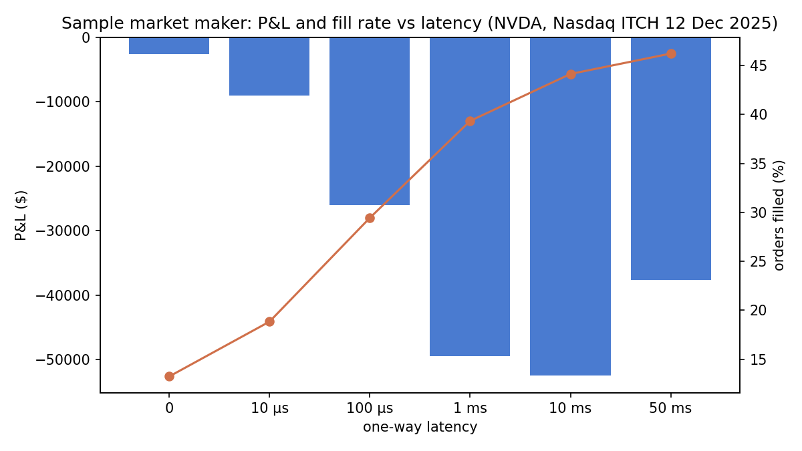

# Benchmarks

Re-measured 2026-09-17, after adding real Nasdaq data and far price levels (see [What changed](#what-changed-on-2026-09-17)). Every number below was measured on this machine in that session; nothing is estimated.

## Environment

| | |
|---|---|
| Machine | ASUS ROG Zephyrus G14 GA402RJ (laptop) |
| CPU | AMD Ryzen 9 6900HS, 8 cores / 16 threads. Caches: L2 4 MB, L3 16 MB (totals reported by Windows) |
| Memory | 16 GB DDR5-4800 (2 × 8 GB) |
| Disk | NVMe SSD, 24 GB free during these runs |
| OS | Windows 11 Home, build 26200, "High performance" power plan |
| JVM | Java HotSpot 25.0.4.1+1-LTS-5, G1, `-Xms2g -Xmx2g -XX:+AlwaysPreTouch` (10 GB for the full-day replay) |
| JMH | 1.37, annotation defaults: 3 forks, 5 × 1 s warm-up, 10 × 1 s measurement, `-prof gc` |
| Background load | Not recorded this session; no other benchmarks running |

### Caveats

- **Noise.** A laptop on Windows is noisy. Error bars are JMH's 99.9% confidence intervals; replay figures are medians over several fresh JVMs. Compare numbers within this document, which were all taken in one session. The synthetic replay measured 19% faster here than on 2026-09-15 with code that does slightly more work, which is the size of the difference machine conditions alone can make.
- **Coarse clock.** `System.nanoTime()` costs about 24 ns per call here and only advances in 100 ns steps. Per-message percentiles are therefore quantised to 100 ns and include the timer's own cost. A fast-book p50 of "1" or "100" means "below the clock's resolution". JMH's averages are the precise per-operation numbers.
- **What is timed.** Decoding a message that is already in memory and applying it to the book. No network, kernel, disk, risk checks or output.
- **JMH warning.** JMH 1.37 prints a "terminally deprecated `sun.misc.Unsafe`" warning on JDK 25. It doesn't affect results.

## What changed on 2026-09-17

- **Real data.** A full Nasdaq TotalView-ITCH 5.0 day, 12 December 2025 (`S121225-v50`, 29.4 GB unzipped), is now surveyed, checked and replayed. Everything before this was synthetic.
- **Far levels.** Every busy stock in that file had resting orders from $0.0001 to $199,999, which a flat ladder can't hold. `OrderBook` now keeps a ladder window around the traded range and puts other prices on far levels ([design](../README.md#design-decisions)). Books built with the old constructors have no far levels and behave as before.
- **Everything below was re-measured**, synthetic results included, because the book's code changed.
- **One fix landed mid-session.** An A/B against the previous commit showed the first version of far levels slowed matching by about 10%, and `match()` was changed to fix it ([Cost of far levels](#cost-of-far-levels)). The JMH fast-book figures, the tape percentiles and the Epsilon run were re-measured after the fix. The replay, real-data and simulation figures were not: they only use book-builder mode, which never calls `match()`, and the two versions are otherwise identical.

## Real data: the whole day

### Survey

`gradlew itchSurvey`: one pass over the file, every stock, following every order through the day.

| | |
|---|---|
| File | 29,388,234,703 bytes, **923,744,247 messages**, surveyed in 194 s (disk-bound at 151 MB/s) |
| Messages by type | A 326,961,520 · D 316,558,570 · U 232,182,245 · E 16,892,741 · X 13,171,185 · P 7,453,788 · I 5,998,183 · F 3,659,468 · C 533,097 · L 271,780 · Q 24,364 · Y 12,645 · H 12,344 · R 12,137 · J 170 · S 6 · K 3 · V 1 |
| Stocks | 12,137 in the directory, 12,119 with order messages |
| Order messages (A F E C X D U) | **909,958,826** |
| Most orders resting at once, all stocks | 5,269,789 |
| Consistency | 0 messages for an order that isn't live, 0 executions or cancels larger than the order, 0 orders left at the end |

Busiest stocks by order messages: SPY 21.2M, QQQ 20.9M, GOOGL 14.5M, NVDA 13.7M, IWM 11.3M, TSLA 8.2M. 29 of the 40 busiest had orders priced from $0.0001 to $199,999.

### Every stock, one book each

`gradlew fullDayReplay -PdayArgs="<file> 2 1024 latency"`: one fast book per stock, every order message of the day routed to its book by locate code.

- **Reading.** The file is read in 1 GB chunks, and only the processing of each chunk is timed: walking the framing, routing, decoding and applying. The file is bigger than memory, and the laptop disk is slower than the books.
- **Sizing.** Every stock is profiled first in two untimed passes (511 s), and each book is sized from its own data. That gives 12,119 books with 28,225,722 ladder levels, 15,985,472 pool slots and 1,476,880 far levels a side between them, about 2.1 GB of heap. Two stocks' ladders hit the 250,000-level cap and fall back to their traded range. 2.27% of order messages touch a far order.

| Run | Order messages | Processing | Order messages/sec | ns each | Slowest / fastest 1 GB chunk | GC |
|---|---|---|---|---|---|---|
| 1 (includes JIT warm-up) | 909,958,826 | 242.8 s | 3,747,426 | 266.8 | 3.35M / 5.48M | none |
| **2** | 909,958,826 | 228.9 s | **3,975,801** | **251.5** | 3.56M / 5.84M | none |

Reading the file took another 21 s per run (1.4 GB/s, from the OS cache), not included above.

After every run: **0 rejected messages, 0 for unknown orders, 0 orders resting at the end, and all 12,119 books structurally valid.**

A third run timed every order message with `System.nanoTime()` (which slows the run to 3.36M/s):

| ns | p50 | p99 | p99.9 | p99.99 | max | GC |
|---|---|---|---|---|---|---|
| order message, whole market | 200 | 1,100 | 1,600 | 5,503 | 708,607 | none |

What it shows:
- **The whole market is memory-bound, not code-bound.** Per message, the whole-market replay is 4 to 7 times slower than replaying one stock (next section). 2.1 GB of books against a 16 MB L3 cache means consecutive messages, which usually belong to different stocks, land on cold memory. This is the pool-size finding below at market scale.
- **One core keeps up with the whole of Nasdaq.** The file runs from 03:01 to 20:05, so its 910M order messages average 14,818 a second; bursts run far higher, and this measures processing speed, not burst handling. At about 4M a second this thread has roughly 270 times the average rate in hand. A production feed handler would still shard stocks across cores to keep each core's working set in cache.

## Real data: single stocks

`gradlew itchExtract` cut seven busy stocks into their own files; each file holds the day's system events, the stock's directory entry and its order and trade messages, byte for byte.

### Checked against the reference book

`gradlew realCheck`: each stock replayed into the fast book and `RefOrderBook` side by side.
- **After every order message:** both books must agree on the touch, the order count and whether the message was accepted.
- **Every execution:** both must report the same resting order, price and size.
- **Every 1,000 messages:** the full depth of both sides must match.
- **Every 250,000 messages:** the fast book's structure is validated.

| Stock | Order messages | Executions | Most resting | Ladder levels | Far levels used (most) | On far levels | Result |
|---|---|---|---|---|---|---|---|
| AAPL | 3,511,772 | 114,259 | 54,981 | 12,753 | 2,777 | 1.26% | **match** |
| AMZN | 4,337,935 | 106,818 | 95,133 | 10,870 | 1,369 | 0.86% | **match** |
| TSLA | 8,168,618 | 252,767 | 131,362 | 22,546 | 4,206 | 1.13% | **match** |
| NVDA | 13,712,675 | 555,012 | 212,263 | 8,936 | 3,093 | 0.63% | **match** |
| GOOGL | 14,542,646 | 171,046 | 53,811 | 14,992 | 3,476 | 0.31% | **match** |
| QQQ | 20,922,415 | 370,746 | 43,405 | 29,181 | 1,465 | 0.06% | **match** |
| SPY | 21,203,964 | 492,037 | 1,088 | 31,874 | 23 | 0.001% | **match** |

**86.4 million real order messages with 0 mismatches of any kind, 0 rejections and 0 unknown orders in either book.** No stock's rebuilt book was ever locked or crossed, which a correct rebuild of Nasdaq's own book shouldn't be, and every book ended the day empty.

### Replay throughput and latency

`gradlew replayLatency -PreplayArgs="<book> 4 data/real/<T>.itch <T>"`, the same protocol as the synthetic session below. Each JVM profiles the stock first (untimed), then replays it 4 times into fresh books and reports the median of runs 2–4. Every stock ran in 3 JVMs per book, interleaved in rotating order; the table gives the median of those medians. Messages include the day's system events and the stock's hidden-trade messages.

| Stock | Messages | **Fast** msg/s (ns) | `RefLinkedOrderBook` | `RefOrderBook` | Fast vs reference |
|---|---|---|---|---|---|
| SPY | 21.2M | **26.95M (37.1)** | 14.85M (67.4) | 12.43M (80.4) | 2.2× |
| QQQ | 20.9M | **22.27M (44.9)** | | | |
| GOOGL | 14.6M | **19.87M (50.3)** | | | |
| AAPL | 3.5M | **19.20M (52.1)** | 9.01M (111.0) | 8.06M (124.1) | 2.4× |
| AMZN | 4.4M | **18.32M (54.6)** | | | |
| NVDA | 13.8M | **16.69M (59.9)** | 5.36M (186.5) | 4.69M (213.1) | 3.6× |
| TSLA | 8.3M | **15.77M (63.4)** | | | |

Per-JVM fast-book medians (M msg/s): SPY 27.10, 26.95, 26.41; QQQ 22.38, 21.68, 22.27; GOOGL 19.93, 19.87, 19.21; AAPL 19.38, 18.82, 19.20; AMZN 18.63, 18.32, 18.23; NVDA 16.05, 17.00, 16.69; TSLA 14.83, 16.65, 15.77.

Per-message latency, `System.nanoTime()` around each message's decode and apply (ns, median of each percentile across the JVMs):

| ns | p50 | p99 | p99.9 | p99.99 | max | GC during the pass |
|---|---|---|---|---|---|---|
| SPY fast | ≤ 100 | 100 | 200 | 400 | 182,271 | none |
| SPY `RefLinkedOrderBook` | 100 | 200 | 400 | 1,600 | 1,602,559 | 2 collections, 2–3 ms |
| SPY `RefOrderBook` | 100 | 200 | 400 | 1,700 | 1,549,311 | 2 collections, 3 ms |
| AAPL fast | 100 | 200 | 300 | 600 | 83,455 | none |
| AAPL `RefLinkedOrderBook` | 100 | 400 | 700 | 2,901 | 2,611,199 | 1 collection, 2–3 ms |
| AAPL `RefOrderBook` | 100 | 400 | 800 | 2,901 | 2,400,255 | 1 collection, 2–3 ms |
| NVDA fast | 100 | 300 | 400 | 800 | 231,551 | none |
| NVDA `RefLinkedOrderBook` | 100 | 700 | 1,000 | 4,203 | 7,335,935 | 2 collections, 14–15 ms |
| NVDA `RefOrderBook` | 200 | 800 | 2,201 | 5,103 | 7,192,575 | 2 collections, 13–14 ms |
| AMZN fast | 100 | 200 | 400 | 600 | 91,135 | none |
| GOOGL fast | 100 | 200 | 300 | 600 | 139,519 | none |
| QQQ fast | 100 | 200 | 300 | 500 | 155,007 | none |
| TSLA fast | 100 | 300 | 400 | 1,000 | 146,175 | none |

What it shows:
- **Real stocks replay at 16–27M messages a second, 37–63 ns each**, close to the synthetic session. The fast book is 2.2–3.6× the reference book.
- **The deeper the book, the slower.** SPY never had more than 1,088 orders resting and is the fastest. NVDA and TSLA had 131,000–212,000 and are the slowest: their pools have 524,288 slots and their id maps are 12.6 MB, past L2 and most of L3.
- **The O(1) cancel matters much less on real data.** `RefLinkedOrderBook` is only 1.1–1.2× `RefOrderBook` here, against 2.0× on the synthetic session, so on real data most of the fast book's lead comes from the ladder, pool and primitive map. The likely reason is that real cancels have fewer orders ahead of them than the synthetic flow's (a median of about 127 there), but queue position at cancel wasn't measured on the real stocks.
- **GC is the reference books' tail; the fast book has none.** Their 1.5–7.3 ms maxima coincide with G1 collections (13–15 ms of them on NVDA). The fast book collected nothing in any pass; its 83–231 µs maxima are most likely OS scheduling.

## Zero allocation on the hot path

Proven three independent ways:

| Method | Result |
|---|---|
| `ZeroAllocationTest` (runs on every build): per-thread allocation counter across 10 tape replays | **0 bytes** for the fast book. The same measurement on the reference book reads millions of bytes. |
| `gradlew epsilonSmoke`: Epsilon GC (never collects), 512 MB heap | **200,375,208 messages replayed, 0 bytes allocated**, 5.6 s, 35,999,316 messages/sec |
| JMH `-prof gc`, `gc.alloc.rate.norm` | **0.000–0.011 B/op** on every fast-book benchmark with the book-sized pool. The reference books allocate 93–9,184 B/op. |

On real data, every fast-book replay pass above and all three full-day runs recorded 0 GC collections.

## Cost of far levels

Far levels add work to the hot path: matching checks whether the resting side has any, and resting and removing an order check whether its level is on the ladder. To measure that, the commit before far levels (`769d00b`) and this one were benchmarked in the same session.

JMH, fast book, 6 forks each:

| ns/op | Before far levels | First version | **Final** | Final vs before |
|---|---|---|---|---|
| `TapeBenchmark.replayOneMessage` | 30.8 ± 0.5 | 33.6 ± 0.9 | **31.8 ± 0.6** | +3% |
| `crossOneOrderAndReplenish` | 36.6 ± 0.6 | 40.7 ± 1.8 | **38.6 ± 0.5** | +5% |

In the first version, every step of the matching loop checked for far levels and compared prices instead of ladder indexes, and every one of its forks was slower than every fork before. Matching can only remove resting orders, so if the resting side has no far levels when matching starts it can't gain any. The final version checks once and otherwise runs the original loop. The remaining few percent is the branch in resting and removing orders.

Book-builder replay, which is what real data uses, never matches. The synthetic replay with the pre-far-level jars and the final jars, 4 JVMs each, alternating:

| | JVM medians (M msg/s) | Median |
|---|---|---|
| Before far levels | 25.98, 26.18, 25.14, 24.25 | 25.56M |
| Final | 25.08, 25.88, 25.75, 24.56 | 25.42M |

That is a 0.5% difference, inside the spread of either. The untimed tape replay also measured 29.0 ns/message on both, once warmed up.

## Synthetic session

`gradlew itchSession` generates a full trading day (09:30 to 16:00, seed 20260914, default `FlowConfig`), writes it as ITCH 5.0, replays the file into the fast book once, then replays it again and checks it against the generator's reference book after every event. A single run, not a JMH measurement.

| | |
|---|---|
| File | 119,300,866 bytes |
| Messages | 3,976,273: 1,749,123 add, 81,667 execute, 218,413 cancel, 1,707,765 delete, 219,298 replace, 7 session |
| Flow | 3,941,931 Hawkes events, 13,275,981 shares traded, cancel-to-trade 23.6 : 1; price opens at $150.00, closes at $146.97 / $146.98; at most 5,000 resting orders |
| Generation (reference book matching, ITCH writing, recording the reference book's state for the check) | 1.31 s, **3,034,694 messages/sec** |
| Replay into the fast book, one cold run including JIT warm-up | 0.234 s, **17,009,268 messages/sec, 58.8 ns/message** |
| Check | 3,941,931 of 3,941,931 events matched on touch and order count; 3,942 full-depth snapshots (every 1,000 events) matched; 81,667 of 81,667 executions matched; 0 rejected messages, 0 referring to an unknown order; closing touch 146.97 / 146.98 with 4,998 resting orders; structure valid |

### Replay

`gradlew replayLatency -PreplayArgs="<book> 4"`: the session file (3,976,272 messages delivered), replayed from a memory-mapped file into a fresh book on a single thread. Each JVM replays 4 times; run 1 is warm-up and excluded, and the JVM reports the median of runs 2–4. Pages of the mapping are touched before timing. Every book ran in 5 separate JVMs, interleaved in rotating order; the table gives the median of those 5 medians.

| Book | Median msg/s | ns/msg | Per-JVM medians (M msg/s) |
|---|---|---|---|
| `RefOrderBook` (TreeMap + ArrayDeque) | 8.21M | 121.8 | 7.86, 8.41, 8.15, 8.21, 8.38 |
| `RefLinkedOrderBook` (TreeMap + O(1) cancel) | 16.71M | 59.9 | 17.02, 15.69, 15.99, 16.71, 17.47 |
| **`OrderBook`, pool 16,384** | **25.60M** | **39.1** | 25.72, 25.67, 25.60, 25.45, 25.59 |
| `OrderBook`, pool 1,048,576 (1 JVM) | 15.63M | 64.0 | 15.63 |

| ns | p50 | p99 | p99.9 | p99.99 | max | GC during the pass |
|---|---|---|---|---|---|---|
| `RefOrderBook` | 100 | 400 | 600 | 2,901 | 1,732,607 | 1 collection, 1–2 ms, in 4 of 5 |
| `RefLinkedOrderBook` | 100 | 200 | 400 | 1,300 | 1,360,895 | 1 collection, 1–2 ms, in 4 of 5 |
| **`OrderBook`, pool 16,384** | **≤ 100** | **100** | **200** | **500** | **45,503** | **none** |
| `OrderBook`, pool 1,048,576 | 100 | 300 | 400 | 700 | 35,903 | none |

- **The fast book is 3.1× the reference book** on the synthetic session, and the O(1) cancel alone gives 2.0× of that, much more than on real data.
- **The pool size finding still holds**: a 1M-order pool (a 24 MB id map, past the 16 MB L3 cache) costs 39% of the throughput.

### Benchmark tape

`MessageTape`: 1,005,999 messages per pass. 48% passive limit adds, 3% crossing limit orders, 43% cancels, 5% reduces, against a prefilled book of 50 levels a side with 10 orders per level. The flow never has more than 5,000 orders resting, and the tape restores the book at the end of each pass. This is matching mode, not book-builder mode.

| | Fast book | `RefLinkedOrderBook` | Reference book |
|---|---|---|---|
| JMH `TapeBenchmark.replayOneMessage` | **31.8 ± 0.6 ns/msg** (6 forks) | 49.7 ± 2.9 ns/msg | 119.6 ± 1.3 ns/msg |
| Untimed replay (`gradlew latency`) | **34,516,609 msg/s** (29.0 ns) | | 8,541,005 msg/s (117.1 ns) |
| Allocation (JMH) | **0 B/op** | 97.0 B/op | 93.2 B/op |

The standard 3-fork run of the fast book gave 33.9 ± 2.0 ns/msg (forks 31.9, 32.9, 36.9); the 6-fork figure comes from the [far-level A/B](#cost-of-far-levels).

Service time for 10,059,990 messages (10 passes), `gradlew latency`. Values are quantised to 100 ns and include about 24 ns of `nanoTime` overhead; a p50 of 1 means most messages finished within one clock step.

| ns, fast book | p50 | p99 | p99.9 | p99.99 | max |
|---|---|---|---|---|---|
| limit add (passive) | 1 | 100 | 300 | 500 | 130,239 |
| limit add (crossing) | 100 | 200 | 400 | 700 | 30,703 |
| cancel | 1 | 100 | 200 | 500 | 129,151 |
| reduce | 1 | 100 | 200 | 500 | 40,127 |
| **all messages** | **1** | **100** | **300** | **500** | **130,239** |

| ns, reference book | p50 | p99 | p99.9 | p99.99 | max |
|---|---|---|---|---|---|
| limit add (passive) | 100 | 200 | 300 | 1,400 | 1,779,711 |
| limit add (crossing) | 100 | 200 | 500 | 1,200 | 31,711 |
| cancel | 200 | 400 | 600 | 3,801 | 122,303 |
| reduce | 100 | 400 | 500 | 1,000 | 33,407 |
| **all messages** | **100** | **400** | **500** | **2,101** | **1,779,711** |

### Coordinated omission

The fast book at a fixed 100,000 messages/sec for 10 seconds, with one 50 ms stall injected halfway (standing in for a GC pause).

| ns | p50 | p99 | p99.9 | p99.99 | max |
|---|---|---|---|---|---|
| service time (from actual start) | 1 | 400 | 600 | 2,701 | 50,561,023 |
| response time (from intended start) | 1 | 700 | **40,992,767** | **49,643,519** | 50,561,023 |

The stall delayed about 5,000 messages. Measured from each message's actual start, it shows up as a single slow sample and p99.9 looks like 0.6 µs. Measured from when each message was due, the true p99.9 is 41 ms.

## Single operations (JMH)

`OrderBookBenchmark`: each operation leaves the book exactly as it found it, against the same prefilled book. Fast book pool 16,384 orders.

| Operation | Fast (ns/op) | `RefLinkedOrderBook` | Reference | Fast B/op | Reference B/op |
|---|---|---|---|---|---|
| `addPassiveThenCancel`: join the back of a level, cancel | **28.6 ± 0.7** | 41.9 ± 1.2 | 46.4 ± 1.3 | 0 | 192 |
| `cancelFromDeepQueueAndRejoin`: random cancel from a queue of 1,000 | **30.9 ± 0.4** | 55.7 ± 2.1 | 268.1 ± 7.0 | 0 | 216 |
| `crossOneOrderAndReplenish`: take one front order, replace it | **38.2 ± 0.8** | 39.4 ± 1.3 | 41.4 ± 1.4 | 0 | 192 |
| `sweepFiveLevelsAndReplenish`: 50 fills, 50 adds | **1,644.6 ± 45.7** | 2,130.3 ± 132.2 | 1,912.2 ± 69.0 | 0.011 | 9,184 |

The reference books' figures come from the full suite; the fast book's were re-measured after the [matching fix](#cost-of-far-levels), which doesn't touch the reference books.

## Finding: pool size decides whether the fast book wins

The same benchmarks on the fast book with a 1,048,576-order pool. The pool size also sets the id map's size.

| Fast book | Pool 16,384 | Pool 1,048,576 | Reference book |
|---|---|---|---|
| `addPassiveThenCancel` (ns/op) | **28.6 ± 0.7** | 85.3 ± 2.2 | 46.4 ± 1.3 |
| `cancelFromDeepQueueAndRejoin` (ns/op) | **30.9 ± 0.4** | 38.0 ± 0.6 | 268.1 ± 7.0 |
| `crossOneOrderAndReplenish` (ns/op) | **38.2 ± 0.8** | 108.4 ± 3.1 | 41.4 ± 1.4 |
| `sweepFiveLevelsAndReplenish` (ns/op) | **1,644.6 ± 45.7** | 3,579.4 ± 171.9 | 1,912.2 ± 69.0 |
| `TapeBenchmark.replayOneMessage` (ns/msg) | **33.9 ± 2.0** | 86.0 ± 26.7 | 119.6 ± 1.3 |
| Synthetic replay (msg/s) | **25.60M** | 15.63M | 8.21M |

One of the three forks of the 1M-pool tape was disturbed (58.7, 57.7 and 141.6 ns); the two clean forks put it at about 58 ns.

The worst-case pool costs 2–3× on everything that touches the id map, and inverts three of the four single-operation results against the TreeMap book. Only `cancelFromDeepQueueAndRejoin`, which is dominated by the reference book's queue scan, survives it.

- **The id map is bigger than the cache.** With a 1M-order pool, `LongIntMap` has 2,097,152 slots of 8-byte keys and 4-byte values: 24 MB, more than the 16 MB L3 cache. Mixing the key's bits sends each order id to an effectively random slot, so nearly every add, cancel and fill pays a main-memory read. At 16,384 orders the map is 393 KB.
- **Real data shows the same effect twice.** NVDA and TSLA, with the deepest real books, are the slowest single stocks; the whole market, with 2.1 GB of books, is 4 to 7 times slower per message than any one stock.
- **Crossing is still expensive.** Each fill touches an order's fields in seven separate pool arrays (id, qty, level, side, sequence, next, prev), plus the level arrays: many cache lines per order.

Possible follow-ups, none done yet:
- Pack each order's hot fields into one or two cache lines.
- Try huge pages to cut TLB misses.
- Shard the whole-market replay across cores so each core's books fit in its cache.

## Touch search: bitset vs linear scan

`TouchSearchBenchmark`: cancel the best bid when the next bid is `gap` levels below, then restore it.

| Gap (levels) | Bitset (ns/op) | Linear scan (ns/op) |
|---|---|---|
| 1 | 32.2 ± 1.1 | **30.6 ± 1.5** |
| 100 | **35.1 ± 2.3** | 44.0 ± 3.3 |
| 10,000 | **127.3 ± 20.4** | 1,627.5 ± 33.4 |

The bitset bounds the worst case: 12.8× faster across a 10,000-level gap (about 15× from the two undisturbed forks: 112.8, 100.6 and 168.5 ns), and within noise of the scan when levels are adjacent.

## Id map: LongIntMap vs HashMap<Long, Integer>

100,000 live sequential ids. "Churn" adds the next id and removes the oldest; "get" looks up random live ids.

| | LongIntMap (MIX) | HashMap |
|---|---|---|
| churn | 32.6 ± 1.1 ns, **0 B/op** | **16.2 ± 1.1 ns**, 96 B/op |
| get | 7.4 ± 0.1 ns, **0 B/op** | 8.2 ± 0.3 ns, 24 B/op |

`HashMap` still wins churn on sequential keys: a `Long` hashes almost to itself, so consecutive ids sit in neighbouring buckets and stay in cache. Its allocation is the price: 96 bytes per churn operation, which eventually means GC pauses.

### Hashing experiment

| | MIX, table for 100k | MIX, table for 1M | IDENTITY, table for 100k | IDENTITY, table for 1M |
|---|---|---|---|---|
| churn (ns/op) | **32.6 ± 1.1** | 32.2 ± 1.1 | 72,073.9 ± 2,950.1 | 74,083.7 ± 2,507.7 |
| get (ns/op) | 7.4 ± 0.1 | 5.2 ± 0.2 | **3.3 ± 0.0** | **3.2 ± 0.0** |

Without mixing, lookups get about 2× faster, but removal becomes catastrophic, about 2,200× slower: 100,000 sequential live keys form one unbroken run of occupied slots, and backward-shift deletion scans to the end of that run on every remove. Mixing the key's bits is the right default for linear probing. This is why the guide recommends it, although its stated reason (long probe chains on insert) isn't where the cost shows up.

## Simulation: market maker P&L vs latency

`gradlew latencySweep` replays a session six times with `SampleMarketMaker`:
- quotes 100 shares a side at the touch (one tick inside when the spread is 3+ ticks)
- has a position limit of 1,000
- earns a $0.0020/share maker rebate and pays a $0.0030/share taker fee

Latency is the same in both directions, with exponential jitter averaging 10% of it. P&L is marked to the mid at the close. The same session and seed are used for every run. Negative fees are net rebates earned.

### Synthetic session

Identical, to the cent and the share, to the results before the book changed: far levels don't alter any decision the simulation makes.

| One-way latency | P&L $ | Net fees $ | Volume | Fills | Orders | Orders filled | Max \|position\| |
|---|---|---|---|---|---|---|---|
| 0 | −3,781.59 | −397.98 | 207,247 | 2,622 | 3,612 | 62.3% | 1,098 |
| 10 µs | −6,431.85 | −351.33 | 213,661 | 2,656 | 3,887 | 59.3% | 1,099 |
| 100 µs | −6,439.15 | −353.03 | 213,261 | 2,655 | 3,888 | 59.2% | 1,099 |
| 1 ms | −6,736.92 | −347.83 | 210,217 | 2,628 | 3,828 | 59.2% | 1,098 |
| 10 ms | −7,678.18 | −320.73 | 192,000 | 2,442 | 3,509 | 58.2% | 1,099 |
| 50 ms | −9,350.76 | −231.18 | 148,416 | 1,951 | 2,838 | 53.7% | 1,097 |

### Real stocks

`gradlew latencySweep -PsweepArgs="real data/real/<T>.itch <T>"`, the same strategy on a real stock's full day. Each replay with the strategy took 0.5–3.5 s.

| One-way latency | NVDA P&L $ | NVDA orders filled | SPY P&L $ | SPY orders filled | AAPL P&L $ | AAPL orders filled |
|---|---|---|---|---|---|---|
| 0 | −2,618 | 13.2% | −8,385 | 16.5% | −7,841 | 16.3% |
| 10 µs | −8,994 | 18.8% | −17,682 | 23.9% | −9,146 | 16.4% |
| 100 µs | −26,032 | 29.4% | −40,673 | 37.9% | −13,877 | 20.4% |
| 1 ms | −49,509 | 39.3% | −100,905 | 52.5% | −15,606 | 25.2% |
| 10 ms | −52,504 | 44.1% | −87,515 | 53.6% | −15,640 | 27.8% |
| 50 ms | −37,609 | 46.2% | −53,552 | 50.0% | −15,007 | 30.3% |

NVDA in full:

| One-way latency | P&L $ | Net fees $ | Volume | Fills | Orders | Orders filled | Rejected | Max \|position\| |
|---|---|---|---|---|---|---|---|---|
| 0 | −2,618.15 | −11,666.83 | 5,971,073 | 184,902 | 715,578 | 13.2% | 0 | 1,099 |
| 10 µs | −8,993.96 | −13,081.40 | 7,598,105 | 207,764 | 657,569 | 18.8% | 0 | 1,099 |
| 100 µs | −26,032.46 | −14,976.15 | 12,214,290 | 344,375 | 531,805 | 29.4% | 1 | 1,099 |
| 1 ms | −49,509.24 | −10,621.12 | 14,657,602 | 402,042 | 421,247 | 39.3% | 0 | 1,099 |
| 10 ms | −52,504.35 | −1,523.28 | 11,839,748 | 291,923 | 289,731 | 44.1% | 2 | 1,099 |
| 50 ms | −37,609.47 | 4,172.91 | 7,432,677 | 156,141 | 168,926 | 46.2% | 2 | 1,099 |



What it shows:
- **Latency costs far more on real flow.** On NVDA the loss grows 20× from zero latency to 10 ms, and on SPY 12× to 1 ms, against 2.5× across the whole synthetic range. Real books change far more often than the synthetic one, so a slower maker's quote is stale more often when it is hit.
- **Slower makers get filled more, and that is bad news.** The share of orders filled rises with latency on every stock: the extra fills are stale quotes being picked off. At 0 latency the maker cancels those quotes before the move reaches it.
- **Past 10 ms the loss shrinks, because so does the trading.** At 50 ms the maker sends a quarter of the orders it sends at zero latency, and starts paying net taker fees.
- **Treat the dollar amounts with care.** The simulator has no market impact: the maker's fills don't remove the liquidity that real orders then trade against, and nobody reacts to its quotes. With 100-share quotes at the touch of the busiest stocks all day, that matters: the maker trades up to 33 million SPY shares in a day, and nothing checks that against the liquidity that was really there. The direction and the shape of the latency effect are the results to rely on, not the size.
- **Rejected orders** (at most 3 a run) are orders that reached the exchange after the close, or quotes priced off the ladder window, which the simulator only accepts on the ladder.

## Threading: pipelined replay

`gradlew pipelinedReplay` replays the synthetic session file (3,976,272 messages delivered) into a fast book. It runs 3 warm-up runs, then 7 measured runs per mode, and checks every run's final book against the single-threaded one. In two-thread mode:
- the main thread walks the file's framing and publishes each message's offset into a 65,536-slot `SpscLongRingBuffer`
- a second thread decodes the messages and applies them to the book

| Mode | Median msg/s | Best msg/s | Median ns/msg |
|---|---|---|---|
| **single thread** | **26,342,243** | 26,629,163 | 38.0 |
| two threads, spin | 21,118,985 | 28,274,184 | 47.4 |
| two threads, yield | 21,328,384 | 22,108,824 | 46.9 |
| two threads, park | 24,724,738 | 25,497,733 | 40.4 |

**Two threads don't help file replay.** All three two-thread modes have a lower median than one thread.
- **Nothing to offload.** Walking the length prefixes is a few instructions per message, so moving it to another thread saves almost nothing. The book thread still decodes and applies every message, and now pays for a ring buffer hop as well.
- **Where it would help.** The design pays off when the producer does slow, blocking work the book shouldn't wait on, such as reading a live feed from a socket. Here it is a demonstration of the single-writer principle, not a speedup, and none of the latency figures above use it.

## Coverage

`gradlew jacocoTestReport`: 234 tests, **66.9% line coverage** of the main source set (2,027 of 3,032 lines). The command-line entry points in `obs.app` have no unit tests, and this change added five of them; without them coverage is 92.7%. By package: `obs.core` 95.0%, `obs.mem` 99.3%, `obs.ref` 99.2%, `obs.feed` 88.8%, `obs.feed.itch` 91.2%, `obs.sim` 97.7%. `StockProfile.measureAll`, which only the whole-day replay uses, is the main untested new code; the real-data runs above exercise it.

## Reproducing

```
gradlew test                                                        # includes ZeroAllocationTest
gradlew jacocoTestReport                                            # coverage, build/reports/jacoco
gradlew itchSession                                                 # full-day synthetic ITCH: generate, replay, check every event
gradlew replayLatency "-PreplayArgs=fast"                           # also ref, refLinked, fast:1048576; run each several times
gradlew epsilonSmoke                                                # 200M messages under Epsilon GC
gradlew latency                                                     # tape percentiles and coordinated omission demo
gradlew pipelinedReplay                                             # single-thread vs two-thread ITCH replay
gradlew latencySweep                                                # market maker P&L at 0 / 10 us / 100 us / 1 ms / 10 ms / 50 ms
python tools/plot_pnl.py                                            # charts from the sweep CSVs (needs matplotlib)
gradlew jmh "-PjmhArgs=-prof gc TapeBenchmark OrderBookBenchmark TouchSearchBenchmark LongIntMapBenchmark"
gradlew jmh "-PjmhArgs=-prof gc -p impl=fast -p poolCapacity=1048576 TapeBenchmark OrderBookBenchmark"
```

With a real day, `S121225-v50.txt` (Nasdaq's sample TotalView-ITCH 5.0 file, unzipped):

```
gradlew itchSurvey    "-PsurveyArgs=S121225-v50.txt 40"
gradlew itchExtract   "-PextractArgs=S121225-v50.txt data/real SPY QQQ GOOGL NVDA TSLA AMZN AAPL"
gradlew realCheck     "-PcheckArgs=data/real AAPL AMZN TSLA NVDA GOOGL QQQ SPY"
gradlew replayLatency "-PreplayArgs=fast 4 data/real/NVDA.itch NVDA"   # also ref, refLinked
gradlew fullDayReplay "-PdayArgs=S121225-v50.txt 2 1024 latency"      # needs about 10 GB of heap
gradlew latencySweep  "-PsweepArgs=real data/real/NVDA.itch NVDA"
python tools/plot_pnl.py build/reports/sim/NVDA "NVDA, Nasdaq ITCH 12 Dec 2025"
```

JMH results are also written to `build/reports/jmh/results.json`.
